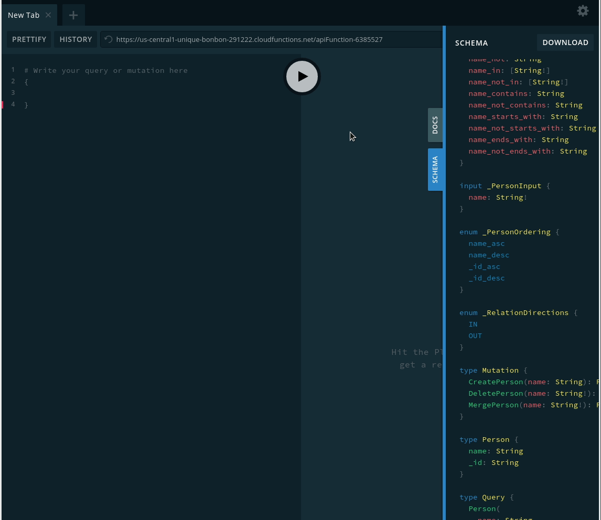

# Pulumi, GrandStack sans React API

An example of a serveless API built with Pulumi, GCP, Apollo and Neo4j

## Stack of the Stack

GCP - https://cloud.google.com/
Apollo - https://www.apollographql.com/docs/apollo-server
Neo4j GraphQl - https://grandstack.io/docs/graphql-schema-generation-augmentation

## Prerequisites

0. [Ensure you have the latest Node.js and NPM](https://nodejs.org/en/download/)
1. [Install the Pulumi CLI](https://www.pulumi.com/docs/get-started/install/)
2. [Configure Pulumi to access your GCP account](https://www.pulumi.com/docs/intro/cloud-providers/gcp/setup/)

## Running the App

1.  Restore NPM dependencies:

    ```
    $ npm install
    ```

2.  Create a new stack:

    ```
    $ pulumi stack init gcp-ts-neo4j
    ```

3.  Configure your GCP project and region:

    ```
    $ pulumi config set gcp:project <projectname>
    $ pulumi config set gcp:region <region>
    ```

4.  Run `pulumi up` to preview and deploy changes:

    ```
    $ pulumi up
    Previewing changes:
    ...

    Performing changes:
    ...
    info: 6 changes performed:
        + 6 resources created
    Update duration: 39.65130324s
    ```

5.  Go to the deployed playground:

    ```
    $ pulumi stack output url
    https://us-central1-pulumi-development.cloudfunctions.net/greeting-function-7f95447
    ```

    

6.  Clean up your GCP and Pulumi resources:

    ```
    $ pulumi destroy
    ...
    $ pulumi stack rm
    ...
    ```

## Dev

`pulumi up`

from `--help`:

This command creates or updates resources in a stack. The new desired goal state for the target stack is computed by running the current Pulumi program and observing all resource allocations to produce a resource graph. This goal state is then compared against the existing state to determine what create,
read, update, and/or delete operations must take place to achieve the desired goal state, in the most minimally disruptive way. This command records a full transactional snapshot of the stack's new state afterwards so that the stack may be updated incrementally again later on.

`pulumi destroy`

Destroy an existing stack and its resources

This command deletes an entire existing stack by name. The current state is
loaded from the associated state file in the workspace. After running to completion,
all of this stack's resources and associated state will be gone.Destroy an existing stack and its resources

This command deletes an entire existing stack by name. The current state is
loaded from the associated state file in the workspace. After running to completion,
all of this stack's resources and associated state will be gone.

`pulumi logs -f`

[PREVIEW] Show aggregated logs for a stack
